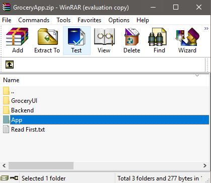
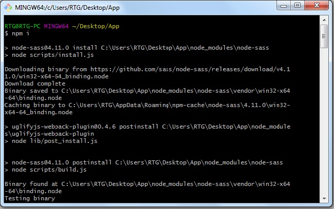

# Grocery-App-Documentation
Grocery App an online grocery shop CMS. Grocery smart grocery shopping List is a free app that improves the quality of your grocery shopping by making it easier, faster, and most importantly smarter. It is all you would want out of a shopping list and more.  


Cross-Platform Android &amp; iOS Ionic 3 App has great UI. Grocery App has a Secure Token-Based SHA 256 Authentication. The project backend is developed by using PHP/MySQL/Slim Restful API. The project has powerful backend cms to manage grocery shop online. it has features like add items, remove items, update price, manage orders, manage banners, manage users etc. 

## How to Setup App

1. Install Node.js https://nodejs.org/dist/v10.15.1/node-v10.15.1-x64.msi

2. Extract 'App' Folder From Zip.



3. Open App folder in any Terminal (Cmd, Gitbash, Powershell) .or Open CMD and Navigate to App Folder.

4. Install Npm Module

```
npm install
```

5. Wait Until Node Module Install . It Take 5-10 Mintue....



6. Install Ionic App Scripts 

```
npm install @ionic/app-scripts@latest --save-dev
```


7. install Ionic Globally (for Ionic Serve)

```
npm install -g ionic@latest
```

8.  install Ionic on Project Folder

```
npm install ionic@latest
```

9. After all that run ionic Project.

```
ionic serve
```

10. Next Step Connect App to Server.
